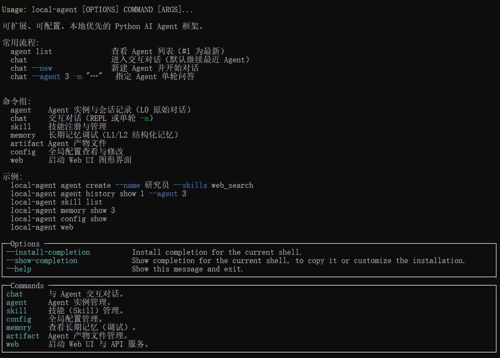
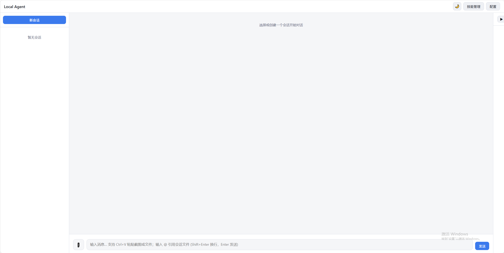
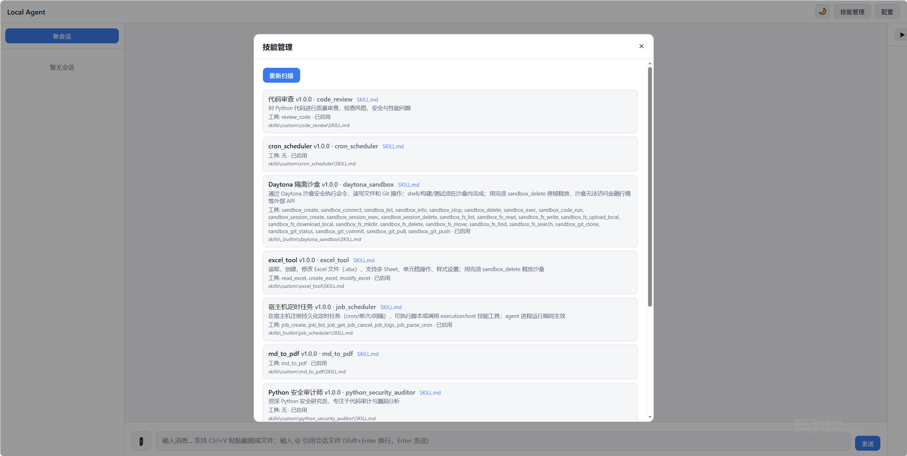

# Local Agent

基于 Python 的可扩展、本地优先 AI Agent 框架。核心思路来自[《250 行 Python 写一个 CLI AI Agent》](https://mp.weixin.qq.com/s/axLHmFoNretapSPCUP68PQ)（`while True` + 工具调用），用 LiteLLM 统一接入各类 LLM，叠加 Skill 注册中心、SQLite 持久化与 TencentDB 风格分层记忆。

## 前言
- 最近在学习agent开发，查阅资料时发现一遍干货满满的文章，思路打通，于是就有了这个项目。
- 部分功能并未完全处理好，项目仅作测试使用，也算是ai agent开发项目的实践研究。

## 文档

- [规划设计开发文档](docs/DESIGN.md) — 架构、模块、数据模型、分期计划

## 功能特性

- **七阶段能力**：流式对话 → 工具调用 → Skill 动态加载 → 斜杠命令 → SQLite 持久化 → 上下文压缩 → 后台定时循环
- **LiteLLM**：支持 OpenAI、Anthropic、Ollama、DeepSeek 等
- **Skill 系统**：目录化 `SKILL.md` + 可选 `tools.py`，支持注册/注销
- **分层记忆**：短期卸载（refs）+ L0-L3 长期记忆管道 + BM25 检索
- **多 Agent 实例**：独立 persona、技能、会话线程

## 安装

```bash
cd local-agent
python -m pip install -e ".[dev]"
```

> **Windows 提示**：若直接输入 `local-agent` 提示找不到命令，是因为 Scripts 目录未加入 PATH。请改用：
> ```bash
> python -m local_agent skill scan
> python -m local_agent chat --new
> ```
> 或将 `C:\Users\<你>\AppData\Roaming\Python\Python313\Scripts` 加入系统 PATH。

可选依赖：

```bash
pip install -e ".[api]"      # FastAPI Web UI
pip install -e ".[memory]"   # sqlite-vec 向量检索
```

## 快速开始

```bash
# 1. 配置 LLM（以 OpenAI 为例）
set OPENAI_API_KEY=sk-...

# 1.1 也可以编辑配置文件
# 编辑 config/default.yaml: model: ollama/qwen3.5:9b, api_base: http://localhost:11434

# 2. 扫描技能
local-agent skill scan

## CLI命令行方式

# 3. 创建 Agent
local-agent agent create --name "全栈助手" --skills web_search,code_review

# 4. 进入对话 REPL
local-agent chat --agent <agent_id>

# 或快速新建并开始
local-agent chat --new --name "临时助手" --skills code_review

## web启动方式
local-agent web
```

## 命令行



## webui



## 技能管理



## REPL 斜杠命令

| 命令 | 说明 |
|------|------|
| `/help` | 显示帮助 |
| `/skills` | 列出可用技能 |
| `/tools` | 列出已注册工具 |
| `/history-list` | 列出历史会话 |
| `/history-load <id>` | 加载历史会话 |
| `/persona` | 显示当前人设 |
| `/context` | 显示 token 用量 |
| `/compact` | 手动压缩上下文 |
| `/start-loop <prompt> <mins>` | 启动后台循环 |
| `/stop-loop` | 停止后台循环 |
| `/exit` | 退出 |

## CLI 命令

```bash
local-agent agent list|create|delete
local-agent chat --agent <id> [-m "消息"]
local-agent skill list|register|unregister|reload|show|scan
local-agent config show|set
local-agent memory show|search
```

## 项目结构

```
local-agent/
├── config/default.yaml       # 全局配置
├── skills/                   # 技能目录
├── src/local_agent/          # 核心代码
│   ├── agent/                # Runtime + Manager
│   ├── cli/                  # Typer CLI + REPL
│   ├── llm/                  # LiteLLM 封装
│   ├── memory/               # 分层记忆
│   ├── skills/               # 技能注册中心
│   ├── storage/              # SQLite
│   ├── tools/                # 工具路由
│   └── api/                  # API + Web UI
└── tests/
```

## 配置

主配置文件：`config/default.yaml`。环境变量：

| 变量 | 说明 |
|------|------|
| `LOCAL_AGENT_CONFIG` | 配置文件路径 |
| `LOCAL_AGENT_DATA_DIR` | 数据目录 |
| `LOCAL_AGENT_LLM_MODEL` | 覆盖 LLM 模型名 |
| `OPENAI_API_KEY` | LiteLLM 自动识别 |

## 开发说明

本项目仅供学习，作者因token花完导致项目中途放弃（bushi）

## 许可证

MIT
