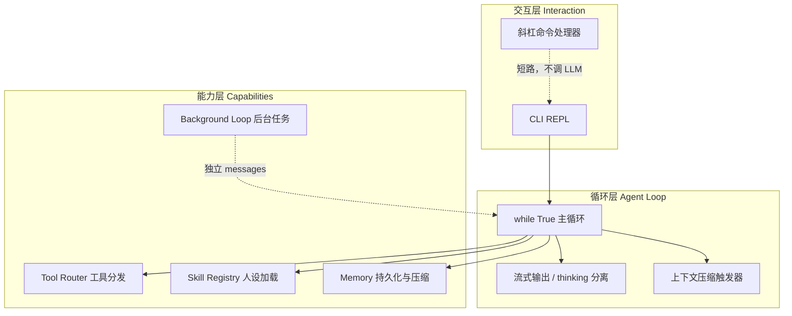
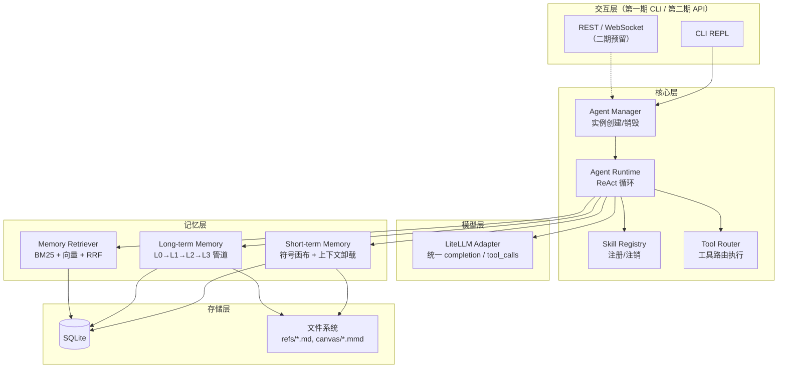
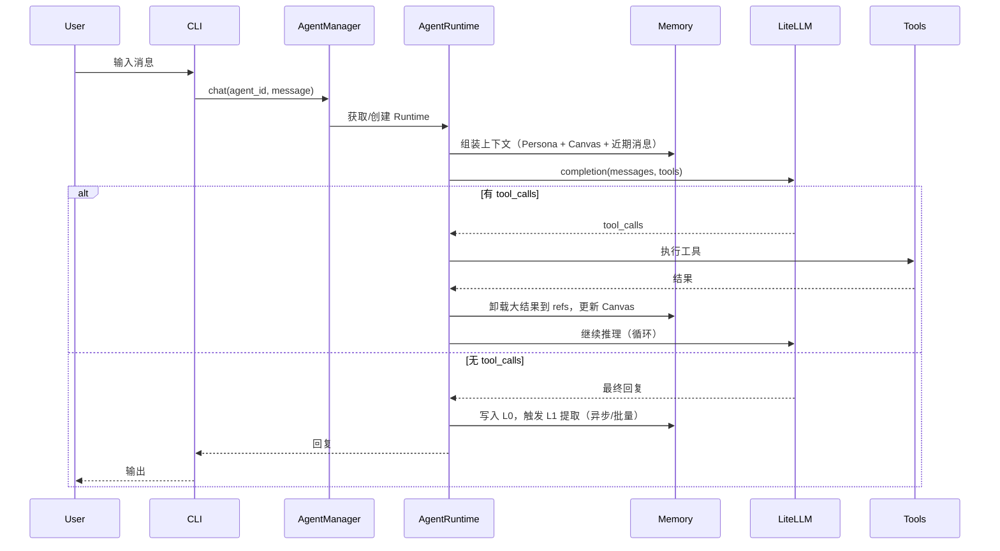
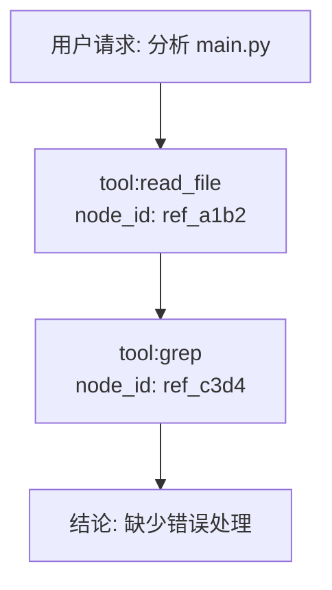
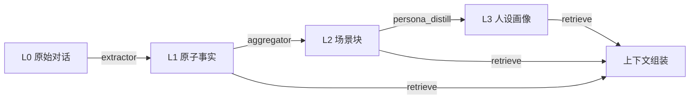

# Local Agent 规划设计开发文档

> 版本：v0.2（第一期 CLI）  
> 技术栈：Python 3.11+  
> 参考文章：《250 行 Python 写一个 CLI AI Agent》（Ollama + qwen3.5，七阶段递进）  
    https://mp.weixin.qq.com/s/axLHmFoNretapSPCUP68PQ
> 增强参考：[TencentDB Agent Memory](https://github.com/Tencent/TencentDB-Agent-Memory) 分层记忆设计

---

## 1. 项目概述

### 1.1 核心理念（来自参考文章）

> **AI Agent 的内核不是复杂框架，而是一个 `while True` 循环加上工具调用协议。LLM 不是大脑，是循环里的路由器。**

本项目**不引入 LangChain / CrewAI / AutoGen**，保持文章同款极简控制流，在其七阶段能力上叠加工程化扩展：

| 文章原教旨 | 本项目坚持 |
|-----------|-----------|
| `while True` + `messages[]` 即 Agent 骨架 | `AgentRuntime.run_loop()` 保持同样结构 |
| LLM 只做路由判断（调哪个工具） | `ToolRouter` 负责执行，LLM 不直接操作环境 |
| 元操作走斜杠命令，内容操作走 LLM | CLI 层短路 `/` 命令，零 token 消耗 |
| 工具 `description` 决定调用时机 | 工具描述用自然语言，不用技术黑话 |
| 工具返回要容错，错误信息给 LLM 重试 | 统一错误包装，禁止 crash 退出循环 |

### 1.2 目标

构建一个**可扩展、可配置、本地优先**的 Python AI Agent 框架，核心能力包括：

- 通过 **LiteLLM** 替代文章中的 `ollama.chat()`，统一接入各类 LLM API（含 Ollama 本地模型）
- 基于文章同款 **while 循环 + tool_calls** 实现多轮工具调用
- **Skill** 独立目录管理，支持注册/注销；保留文章的 `manage_skills` 由 LLM 自主加载人设
- **SQLite** 替代文章的 JSON 文件持久化（保留 JSON 导入/导出）
- **分层记忆系统**（TencentDB 思路）升级文章的 70/30 摘要压缩
- **每次新对话 = 新建智能体实例**，可配置人设、指定技能、全局配置覆盖
- **第一期**：CLI 交互（含文章全部 7 阶段能力）；**第二期**：REST/WebSocket API 供 WebUI

### 1.3 设计原则

| 原则 | 说明 |
|------|------|
| 循环优先 | 核心逻辑可读性对标 250 行文章，框架层薄封装 |
| 本地优先 | 数据默认存 SQLite，不依赖外部向量库（可选用 sqlite-vec） |
| 渐进披露 | Skill 列表摘要进上下文，完整指令按需 `load_skill` |
| 可溯源 | 记忆压缩保留证据链（`node_id` / `ref_path`），压缩后 persona 必重注入 |
| 接口预留 | 核心循环与 CLI/API 解耦，二期 WebUI 直接复用 `AgentRuntime` |
| 配置驱动 | 上下文窗口、工具轮次、压缩阈值均可配（文章写死 4000，本项目放大） |

### 1.4 参考文章七阶段 → 本项目映射

文章用 7 个 Stage 递进搭建 Agent，本项目**按相同顺序实现**，每阶段标注升级点：

```
Stage 1  聊天循环 + 流式输出 + thinking 分离
Stage 2  工具调用协议 + 工具路由 + 结果截断/卸载
Stage 3  Skill 动态加载（manage_skills 工具）
Stage 4  斜杠命令（元操作不走 LLM）
Stage 5  会话持久化（JSON → SQLite）
Stage 6  上下文自动压缩（70/30 摘要 → TencentDB 分层记忆）
Stage 7  后台定时循环（可选，独立消息列表）
```

| Stage | 文章实现 | 本项目实现 | 关键升级 |
|-------|---------|-----------|---------|
| **1** | `ollama.chat(stream=True)` + Qwen thinking/content 分离 | `LiteLLMClient.chat_stream()` + 模型适配 thinking 字段 | 支持多 Provider 流式；`qwen3.5` / `ollama/qwen3.5:9b` 等 |
| **2** | `tools` 参数 + `handle_tools()` + 4000 字符首尾截断 | `ToolRouter.execute()` + `offload_if_large()` | 截断升级为 refs 卸载 + `recall_ref` 按需取回 |
| **3** | `skills/*.md` + `SkillManager` + `active_skill_content` 全局变量 | `skills/` 目录 + `SkillRegistry` 注册/注销 + `manage_skills` 工具 | 目录规范化（`SKILL.md`）；注册中心 + DB 索引；保留 `active_skill_content` 供压缩重注入 |
| **4** | `/skills` `/tools` `/help` 短路 | REPL 斜杠命令层 | 扩展 `/history-list` `/history-load` `/persona` `/stop-loop` 等 |
| **5** | `history/*.json` + `tool_calls.model_dump()` 序列化 | SQLite `messages` 表 + Repository | 解决 tool_call 序列化坑；支持多 Agent / 多 thread |
| **6** | `estimate_tokens` + 70/30 分割 + LLM 摘要 + 重注入 skill | `MemoryCompactor` 轻量模式 + TencentDB 完整模式 | 阈值从 4000 提升到可配 128K；轻量模式兼容文章逻辑 |
| **7** | `threading` + 1 秒分片 sleep + 独立 `loop_messages` | `BackgroundLoopService`（可选） | 同样隔离主会话；`/start-loop` `/stop-loop` 控制 |

### 1.5 文章三层架构（保留）

文章将 Agent 分为三层，本项目模块一一对应：



---

## 2. 系统架构

### 2.1 总体架构图



### 2.2 核心数据流（单轮对话）



### 2.3 模块职责

| 模块 | 职责 |
|------|------|
| `config` | 全局配置加载、校验、热更新 |
| `agent_manager` | 创建/销毁 Agent 实例，绑定 persona、skills、会话 |
| `agent_runtime` | ReAct 主循环，轮次控制，上下文预算 |
| `llm` | LiteLLM 封装，tool schema 转换，流式输出 |
| `skill_registry` | Skill 扫描、注册、注销、元数据索引 |
| `tool_router` | 内置工具 + Skill 工具统一调度 |
| `memory` | 短期压缩、长期分层、检索融合 |
| `storage` | SQLite ORM/Repository，迁移脚本 |
| `cli` | 命令行 REPL、子命令 |
| `api` | 二期 FastAPI 路由（一期仅定义接口骨架） |

---

## 3. 目录结构

```
local-agent/
├── pyproject.toml
├── README.md
├── config/
│   ├── default.yaml          # 全局默认配置
│   └── config.schema.json    # 配置 JSON Schema
├── data/                     # 运行时数据（gitignore）
│   ├── agent.db
│   ├── refs/                 # 工具结果卸载（L0 证据）
│   ├── canvas/               # Mermaid 任务画布
│   └── personas/             # L3 人设 Markdown
├── skills/                   # Skill 独立目录（可多个子目录）
│   ├── _builtin/             # 内置技能
│   │   └── web_search/
│   │       ├── SKILL.md      # 技能元数据 + 指令
│   │       └── tools.py      # 可选：技能自带工具
│   └── custom/               # 用户自定义技能
│       └── code_review/
│           ├── SKILL.md
│           └── tools.py
├── src/
│   └── local-agent/
│       ├── __init__.py
│       ├── main.py           # CLI 入口
│       ├── config/
│       │   ├── loader.py
│       │   └── models.py     # Pydantic 配置模型
│       ├── llm/
│       │   ├── litellm_client.py
│       │   └── streaming.py
│       ├── agent/
│       │   ├── manager.py
│       │   ├── runtime.py
│       │   └── models.py     # AgentInstance, Persona
│       ├── skills/
│       │   ├── registry.py   # 注册/注销中心
│       │   ├── loader.py     # 扫描 skills/ 目录
│       │   └── models.py     # SkillMetadata
│       ├── tools/
│       │   ├── router.py
│       │   ├── builtin.py    # read_file, shell 等
│       │   └── schema.py
│       ├── memory/
│       │   ├── short_term.py # 画布 + 卸载
│       │   ├── long_term.py  # L0-L3 管道
│       │   ├── extractor.py  # L0→L1 原子提取
│       │   ├── aggregator.py # L1→L2 场景聚合
│       │   ├── persona.py    # L2→L3 人设蒸馏
│       │   ├── retriever.py  # 混合检索
│       │   └── canvas.py     # Mermaid 画布管理
│       ├── storage/
│       │   ├── database.py
│       │   ├── models.py     # SQLAlchemy / 原生 SQL 表
│       │   └── repositories/
│       ├── cli/
│       │   ├── app.py        # Typer/Click 主应用
│       │   ├── commands/
│       │   │   ├── chat.py
│       │   │   ├── agent.py  # 创建/列出 agent
│       │   │   ├── skill.py  # skill 管理命令
│       │   │   └── config.py
│       │   └── repl.py
│       └── api/              # 二期扩展（一期骨架）
│           ├── app.py        # FastAPI 工厂
│           ├── routes/
│           │   ├── agents.py
│           │   ├── chat.py
│           │   ├── skills.py
│           │   └── memory.py
│           └── schemas.py
├── tests/
└── docs/
    └── DESIGN.md             # 本文档
```

---

## 4. 配置系统

### 4.1 配置分层

```
全局配置 (config/default.yaml)
    └── 覆盖：环境变量 LOCAL_AGENT_*
        └── Agent 实例配置 (创建时指定 / DB 持久化)
            └── 会话级覆盖 (CLI 临时参数)
```

### 4.2 全局配置示例 (`config/default.yaml`)

```yaml
app:
  data_dir: "./data"
  log_level: "INFO"

llm:
  provider: "litellm"           # 固定 litellm
  model: "gpt-4o"               # LiteLLM 模型字符串
  api_base: null                # 自定义端点，如 http://localhost:11434
  api_key: null                 # 从环境变量读取
  temperature: 0.7
  max_tokens: 8192
  timeout: 120
  stream: true

agent:
  max_tool_rounds: 30           # 工具调用最大轮次（可调大）
  context_window: 128000        # 上下文窗口预算（token）
  context_reserve: 8000         # 预留给回复的 token
  system_prompt_template: "prompts/default_system.txt"

memory:
  enabled: true
  compact_mode: "full"          # simple=文章70/30摘要 | full=TencentDB分层
  compact_threshold: 32000        # 文章写死 4000；大窗口模型建议 32K+
  compact_split_ratio: 0.7      # 文章经验值：前 70% 摘要，后 30% 保留
  short_term:
    offload_enabled: true       # 大结果卸载到 refs/（替代文章首尾截断）
    offload_threshold_tokens: 4000  # 文章截断阈值
    canvas_enabled: true        # Mermaid 画布注入上下文
    canvas_max_tokens: 1500
  long_term:
    extraction_enabled: true    # L0→L1 自动提取
    aggregation_interval: 10    # 每 N 轮触发 L1→L2
    persona_update_interval: 50 # 每 N 轮更新 L3
  retrieval:
    top_k: 8
    use_vector: true            # sqlite-vec
    use_bm25: true
    rrf_k: 60

skills:
  directories:
    - "./skills/_builtin"
    - "./skills/custom"
  auto_reload: false            # 开发模式可开启热加载

storage:
  sqlite_path: "./data/agent.db"
  enable_wal: true

api:                            # 二期
  enabled: false
  host: "127.0.0.1"
  port: 8080
  cors_origins: ["http://localhost:3000"]
```

### 4.3 Agent 实例配置

每次 `agent create` 或 CLI 新开会话时创建：

```yaml
agent_instance:
  id: "uuid"
  name: "代码助手"
  persona:
    role: "资深 Python 工程师"
    tone: "简洁专业"
    constraints:
      - "优先给出可运行代码"
      - "不编造不存在的 API"
    custom_instructions: "..."
  skills:                       # 加载的技能 ID 列表
    - "web_search"
    - "code_review"
  llm_override:                 # 可选，覆盖全局 LLM
    model: "deepseek/deepseek-chat"
  memory_scope: "agent"         # agent | global | isolated
  created_at: "..."
```

### 4.4 环境变量

| 变量 | 说明 |
|------|------|
| `LOCAL_AGENT_CONFIG` | 配置文件路径 |
| `LOCAL_AGENT_DATA_DIR` | 数据目录 |
| `OPENAI_API_KEY` | LiteLLM 自动识别 |
| `ANTHROPIC_API_KEY` | LiteLLM 自动识别 |
| `LITELLM_API_BASE` | 自定义 API Base |

---

## 5. LiteLLM 模型层（对应文章 Stage 1）

### 5.1 设计目标

用 LiteLLM **一对一替换**文章中的 `ollama.chat()`，接口语义保持不变：

- `chat()` / `chat_stream()` 对应 `ollama.chat(stream=True/False)`
- Tool Calling 传 `tools` 参数（OpenAI Function 格式，与文章一致）
- 多 Provider 切换仅改 `model` 字符串

### 5.2 流式输出与 thinking 分离（文章 Stage 1 核心）

文章对 Qwen 模型做了 thinking / content 分流显示，本项目在 `streaming.py` 保留同等体验：

```python
async def stream_with_thinking(
    client: LiteLLMClient,
    messages: list[dict],
    tools: list[dict] | None = None,
) -> tuple[str, list[ToolCall] | None]:
    """
    遍历 stream chunks：
    - thinking 段 → 打印 [THOUGHT PROCESS]
    - content 段  → 打印 [FINAL ANSWER]
    返回 (full_content, tool_calls)
    """
```

| 模型类型 | thinking 字段来源 |
|---------|------------------|
| Ollama Qwen3.5 | `chunk.message.thinking`（与文章一致） |
| DeepSeek R1 等 | `reasoning_content` / `thinking` 适配层统一 |
| 无 thinking 的模型 | 直接流式输出 content |

### 5.3 接口设计

```python
class LiteLLMClient:
    async def chat(
        self,
        messages: list[dict],
        tools: list[dict] | None = None,
        **kwargs,
    ) -> ChatResponse: ...

    async def chat_stream(
        self,
        messages: list[dict],
        tools: list[dict] | None = None,
        **kwargs,
    ) -> AsyncIterator[StreamChunk]: ...
```

### 5.3 模型字符串示例

| 场景 | model 配置 |
|------|-----------|
| OpenAI | `gpt-4o` |
| Anthropic | `anthropic/claude-sonnet-4-20250514` |
| 本地 Ollama | `ollama/llama3.2` + `api_base: http://localhost:11434` |
| DeepSeek | `deepseek/deepseek-chat` |
| Azure | `azure/gpt-4` + deployment 环境变量 |

### 5.4 Tool Schema 转换

内部统一 OpenAI Function Calling 格式；LiteLLM 负责向各 Provider 适配。`ToolRouter` 输出：

```json
{
  "type": "function",
  "function": {
    "name": "read_file",
    "description": "...",
    "parameters": { "type": "object", "properties": {...} }
  }
}
```

---

## 6. Skill 技能系统（对应文章 Stage 3）

### 6.0 文章思路保留

文章用一个 Markdown 文件表达人设，通过 `manage_skills` 工具让 **LLM 自己决定何时加载**：

```python
# 文章原版 SkillManager 语义，本项目保留为 manage_skills 内置工具
class SkillManager:
  def list_skills(self) -> list[str]: ...
  def load_skill(self, name: str) -> str: ...  # 返回全文，写入 active_skill_content
```

**`active_skill_content` 全局状态（per Agent 实例，非全局变量）**：

- 加载 skill 后注入 system message：`Active Skill: {content}`
- **上下文压缩时必须重注入**（文章 Stage 6 关键细节，否则 Agent「失忆」）
- 存入 SQLite `agents.active_skill_id` + `agents.active_skill_content`

### 6.1 目录规范

文章用 `skills/*.md` 单文件；本项目升级为目录化，**同时兼容简单模式**（单 `.md` 文件直接放 `skills/` 根目录）：

```
skills/custom/my_skill/
├── SKILL.md          # 必需：元数据 + 指令正文（= 文章中的 .md 人设文件）
├── tools.py          # 可选：注册工具函数
└── resources/        # 可选：模板、示例等
```

### 6.2 SKILL.md 格式

```markdown
---
id: code_review
name: 代码审查
version: 1.0.0
description: 对 Python 代码进行质量审查，检查风格、安全与性能问题
author: user
tags: [code, review, python]
tools: [review_code, suggest_fix]    # 本技能提供的工具名
enabled: true
---

# 代码审查技能

## 何时使用
当用户提交代码片段或请求 code review 时激活本技能。

## 工作流程
1. 阅读代码结构与依赖
2. 按 PEP8、安全、性能维度审查
3. 输出分级问题列表与修改建议

## 输出格式
- 🔴 严重 / 🟡 建议 / 🟢 可选优化
```

### 6.3 注册/注销逻辑

```python
class SkillRegistry:
    def register(self, skill_path: Path) -> SkillMetadata: ...
    def unregister(self, skill_id: str) -> None: ...
    def reload(self, skill_id: str) -> SkillMetadata: ...
    def list_skills(self, enabled_only: bool = True) -> list[SkillMetadata]: ...
    def get_skill(self, skill_id: str) -> SkillMetadata | None: ...
    def scan_directories(self) -> int: ...  # 启动时扫描
```

**注册流程：**

1. 解析 `SKILL.md` frontmatter
2. 校验 `id` 唯一性
3. 若存在 `tools.py`，动态加载并注册到 `ToolRouter`（命名空间：`skill.{id}.{tool_name}`）
4. 写入 SQLite `skills` 表
5. 内存索引更新

**注销流程：**

1. 从 `ToolRouter` 移除关联工具
2. 标记 DB `enabled=false` 或删除记录
3. 清除内存缓存

### 6.4 两种加载模式

| 模式 | 触发方式 | 场景 |
|------|---------|------|
| **LLM 自主加载**（文章原版） | `manage_skills(action="load", name="...")` | 对话中按需切换人设，如「帮我做安全审计」 |
| **创建时预加载**（本项目扩展） | `agent create --skills code_review` | 新建智能体即绑定技能，写入 `active_skill_content` |
| **渐进披露**（省 token） | 仅注入 `id + description` 列表，LLM 调用 `load_skill` 取全文 | 技能库很大时 |

文章属于模式一；本项目两种都支持，创建 Agent 时默认模式二，REPL 内可动态 `manage_skills` 切换。

### 6.5 CLI 命令

```bash
local-agent skill list
local-agent skill register ./skills/custom/new_skill
local-agent skill unregister code_review
local-agent skill reload --all
local-agent skill show code_review
```

---

## 7. Agent 运行时（对应文章 Stage 1-2 核心循环）

### 7.1 主循环伪代码（对标文章 while True）

```python
async def run_repl_loop(self):
    """文章同款骨架，包裹在 AgentRuntime 中。"""
    while True:
        user_input = await self.cli.read_input()
        if user_input.lower() in ("quit", "exit", "/exit"):
            break

        # Stage 4：斜杠命令短路，不调 LLM
        if user_input.startswith("/"):
            if self.slash_handler.handle(user_input):
                continue

        self.messages.append({"role": "user", "content": user_input})

        # Stage 6：超阈值自动压缩
        if self.memory.should_compact(self.messages):
            self.messages = await self.memory.compact(self.messages)

        # Stage 1+2：流式推理 + 工具调用（可循环多轮）
        for _ in range(self.config.max_tool_rounds):
            content, tool_calls = await stream_with_thinking(
                self.llm, self.messages, tools=self.tools
            )
            if not tool_calls:
                self.messages.append({"role": "assistant", "content": content})
                await self.storage.save_messages(self.messages)  # Stage 5
                break
            self.messages.append({"role": "assistant", "tool_calls": tool_calls})
            await self.handle_tools(tool_calls)  # Stage 2
        else:
            raise MaxToolRoundsExceeded(...)
```

### 7.2 handle_tools（对标文章 Stage 2）

```python
async def handle_tools(self, tool_calls: list[ToolCall]):
    for tc in tool_calls:
        result = await self.tool_router.execute(tc)
        # 文章：>4000 字符首尾各留 1000
        # 本项目：优先 offload 到 refs/，上下文只留摘要 + node_id
        result = await self.memory.process_tool_result(tc, result)
        self.messages.append({
            "role": "tool",
            "tool_call_id": tc.id,
            "name": tc.name,
            "content": result,
        })
    # 文章在此递归调用 stream_with_thinking；本项目用 for 轮次循环
```

**工具描述规范（文章经验）：**

- ✅ `读取本地文本文件的内容` — LLM 易判断
- ❌ `执行文件 I/O 操作` — 太抽象，几乎不会被调用

### 7.3 Agent Manager

```python
class AgentManager:
    def create_agent(
        self,
        name: str,
        persona: Persona,
        skills: list[str] | None = None,
        llm_override: dict | None = None,
    ) -> AgentInstance: ...

    def get_agent(self, agent_id: str) -> AgentInstance: ...
    def delete_agent(self, agent_id: str) -> None: ...
    def list_agents(self) -> list[AgentInstance]: ...

    async def chat(self, agent_id: str, message: str) -> str: ...
```

**语义：每次 `create_agent` = 新建智能体**，拥有独立 persona、技能集、会话线程与记忆命名空间。

### 7.4 上下文预算策略

在 `context_window`（如 128K）内按优先级组装：

| 优先级 | 内容 | 预算占比建议 |
|--------|------|-------------|
| P0 | System（人设 + 技能摘要） | 5% |
| P1 | Mermaid Canvas（任务状态） | 5% |
| P2 | L3 Persona 摘要 | 5% |
| P3 | 检索到的 L2/L1 记忆 | 15% |
| P4 | 近期对话消息 | 60% |
| P5 | 预留生成 | `context_reserve` |

超出预算时：先压缩 P4 历史（卸载到 refs），再缩减 P3 检索条数。

---

## 8. 记忆系统（对应文章 Stage 5-6，升级 TencentDB）

> 文章 Stage 6 用 70/30 摘要压缩；本项目以此为**轻量模式**，默认启用 TencentDB 风格的**完整模式**。

### 8.0 文章 Stage 6 逻辑（轻量压缩模式）

文章原文逻辑，作为 `compact_mode: simple` 保留：

```python
CONTEXT_THRESHOLD = 4000          # 文章写死；本项目默认 32000，最大可配 128000

def estimate_tokens(messages) -> int:
    text = "".join(str(m.get("content", "")) for m in messages)
    return len(text) // 4          # 粗略估算：4 字符 ≈ 1 token

async def compact_history_simple(messages, active_skill_content: str):
    split_idx = int(len(messages) * 0.7)   # 前 70% 摘要
    to_summarize = messages[:split_idx]
    keep_fresh = messages[split_idx:]      # 后 30% 保留原文
    summary = await llm.summarize(to_summarize, "保留关键事实和当前目标")
    new_history = [{"role": "system", "content": f"PREVIOUS SUMMARY: {summary}"}]
    if active_skill_content:
        # ⚠️ 文章强调：必须重注入，否则压缩后失忆
        new_history.insert(0, {
            "role": "system",
            "content": f"Active Skill: {active_skill_content}",
        })
    new_history.extend(keep_fresh)
    return new_history
```

| 配置项 | 文章默认值 | 本项目默认值 |
|--------|-----------|-------------|
| `compact_threshold` | 4000 tokens | 32000 tokens |
| `compact_split_ratio` | 0.7 | 0.7（可配） |
| `compact_mode` | simple | `full`（TencentDB） |

### 8.1 短期记忆：符号化 + 上下文卸载（完整模式）

**问题：** 长任务中工具返回（代码、搜索结果、日志）迅速撑爆上下文。

**方案：**

1. **上下文卸载**：超过 `offload_threshold_tokens` 的结果写入 `data/refs/{node_id}.md`
2. **Mermaid 画布**：在上下文中仅保留任务结构图，节点带 `node_id`
3. **按需回溯**：提供 `recall_ref(node_id)` 工具，grep 式精确取回原文

**Canvas 示例（注入 system 或独立 message）：**



### 8.2 长期记忆：L0 → L1 → L2 → L3 金字塔

| 层级 | 名称 | 存储 | 内容 | 更新时机 |
|------|------|------|------|----------|
| L0 | Conversation | SQLite `messages` + refs | 原始对话与工具轨迹 | 每轮实时 |
| L1 | Atom | SQLite `memory_atoms` | 事实、偏好、约束、阶段结论 | 每轮/批量 LLM 提取 |
| L2 | Scenario | SQLite + Markdown `scenarios/` | 按任务类型聚合的场景块 | 每 N 轮聚合 |
| L3 | Persona | Markdown `personas/{agent_id}.md` | 稳定用户/智能体画像 | 每 M 轮蒸馏 |

**溯源链：**

```
L3 Persona → L2 Scenario ID → L1 Atom ID → L0 Message/Ref ID
```

### 8.3 记忆管道



### 8.4 检索策略

参照 TencentDB 的混合检索：

- **BM25**：sqlite FTS5 全文检索（关键词精确匹配）
- **向量**：sqlite-vec 存储 embedding（语义相似）
- **RRF（Reciprocal Rank Fusion）**：融合两路排序

暴露给 Agent 的工具：

- `memory_search(query, layer?)` — 跨层检索
- `conversation_search(query)` — L0 对话搜索
- `recall_ref(node_id)` — 短期 refs 回溯

### 8.5 提取 Prompt 要点（L0→L1）

从每轮对话抽取原子记忆，JSON 输出：

```json
{
  "atoms": [
    {
      "type": "fact|preference|constraint|conclusion",
      "content": "用户偏好使用 Typer 而非 Click",
      "confidence": 0.9,
      "source_message_ids": ["msg_001", "msg_002"]
    }
  ]
}
```

---

## 9. SQLite 数据模型（对应文章 Stage 5，替代 JSON）

### 9.0 文章持久化坑位与对策

文章用 `history/{session_id}.json` 保存 `messages`，最大坑：**Ollama 返回的 `tool_calls` 不是原生 dict**，需 `.model_dump()` 才能 `json.dump`。

本项目对策：

1. **入库前统一序列化**：`MessageSerializer.to_db()` 将所有 tool_call 转为 JSON 字符串
2. **读出时反序列化**：`MessageSerializer.from_db()` 还原为 LiteLLM/OpenAI 兼容格式
3. **兼容文章格式**：`local-agent history export --json` 导出为文章同款 JSON；`import` 可导入旧会话

```python
def serialize_tool_calls(tool_calls) -> list[dict]:
    return [
        tc.model_dump() if hasattr(tc, "model_dump") else dict(tc)
        for tc in (tool_calls or [])
    ]
```

### 9.1 核心表

```sql
-- 全局配置快照（可选）
CREATE TABLE config_snapshots (
    id INTEGER PRIMARY KEY,
    key TEXT NOT NULL,
    value TEXT NOT NULL,  -- JSON
    updated_at TEXT NOT NULL
);

-- Agent 实例
CREATE TABLE agents (
    id TEXT PRIMARY KEY,
    name TEXT NOT NULL,
    persona TEXT NOT NULL,       -- JSON
    skills TEXT NOT NULL,        -- JSON array of skill ids
    active_skill_id TEXT,        -- 当前加载的 skill（文章 active_skill_content 关联）
    active_skill_content TEXT,   -- 文章 Stage 3/6 关键字段，压缩时重注入
    llm_override TEXT,           -- JSON, nullable
    memory_scope TEXT DEFAULT 'agent',
    created_at TEXT NOT NULL,
    updated_at TEXT NOT NULL
);

-- 会话线程
CREATE TABLE threads (
    id TEXT PRIMARY KEY,
    agent_id TEXT NOT NULL REFERENCES agents(id),
    title TEXT,
    created_at TEXT NOT NULL,
    updated_at TEXT NOT NULL
);

-- L0 消息
CREATE TABLE messages (
    id TEXT PRIMARY KEY,
    thread_id TEXT NOT NULL REFERENCES threads(id),
    role TEXT NOT NULL,          -- system|user|assistant|tool
    content TEXT,
    tool_calls TEXT,             -- JSON
    tool_call_id TEXT,
    token_count INTEGER,
    ref_path TEXT,               -- 卸载文件路径
    created_at TEXT NOT NULL
);

-- 技能注册表
CREATE TABLE skills (
    id TEXT PRIMARY KEY,
    name TEXT NOT NULL,
    version TEXT,
    description TEXT,
    path TEXT NOT NULL,
    tools TEXT,                  -- JSON array
    enabled INTEGER DEFAULT 1,
    registered_at TEXT NOT NULL
);

-- L1 原子记忆
CREATE TABLE memory_atoms (
    id TEXT PRIMARY KEY,
    agent_id TEXT NOT NULL,
    thread_id TEXT,
    type TEXT NOT NULL,
    content TEXT NOT NULL,
    confidence REAL,
    source_message_ids TEXT,     -- JSON
    embedding BLOB,              -- sqlite-vec
    created_at TEXT NOT NULL
);

-- L2 场景
CREATE TABLE memory_scenarios (
    id TEXT PRIMARY KEY,
    agent_id TEXT NOT NULL,
    title TEXT NOT NULL,
    summary TEXT,
    atom_ids TEXT,               -- JSON
    md_path TEXT,
    created_at TEXT NOT NULL,
    updated_at TEXT NOT NULL
);

-- 工具执行日志
CREATE TABLE tool_executions (
    id TEXT PRIMARY KEY,
    message_id TEXT,
    tool_name TEXT NOT NULL,
    arguments TEXT,
    result_ref TEXT,
    duration_ms INTEGER,
    status TEXT,
    created_at TEXT NOT NULL
);

-- 任务画布
CREATE TABLE canvases (
    id TEXT PRIMARY KEY,
    thread_id TEXT NOT NULL,
    mermaid_content TEXT NOT NULL,
    updated_at TEXT NOT NULL
);

-- FTS5 虚拟表（消息 + 原子记忆全文索引）
CREATE VIRTUAL TABLE messages_fts USING fts5(...);
CREATE VIRTUAL TABLE atoms_fts USING fts5(...);
```

### 9.2 迁移

使用 Alembic 或轻量自研 `migrations/` 版本脚本，启动时自动 `PRAGMA user_version` 检查升级。

---

## 10. 工具系统（对应文章 Stage 2-3）

### 10.1 内置工具（第一期）

| 工具 | 说明 | 文章对应 |
|------|------|---------|
| `read_text_file` | 读取本地文本文件 | ✅ 文章 Stage 2 示例 |
| `get_current_datetime` | 获取当前日期时间 | ✅ 文章 Stage 2 示例 |
| `manage_skills` | `list` / `load` 技能，更新 `active_skill_content` | ✅ 文章 Stage 3 核心 |
| `write_file` | 写入文件（可配置路径白名单） | 扩展 |
| `list_dir` | 列目录 | 扩展 |
| `grep` | 文本搜索 | 扩展 |
| `shell` | 执行 shell（默认关闭） | 扩展 |
| `memory_search` | 长期记忆检索 | TencentDB 扩展 |
| `conversation_search` | L0 对话检索 | TencentDB 扩展 |
| `recall_ref` | 按 node_id 取回卸载内容 | 替代文章粗暴截断 |

### 10.2 Tool Router

```python
class ToolRouter:
    def register(self, name: str, fn: Callable, schema: dict) -> None: ...
    def unregister(self, name: str) -> None: ...
    def get_openai_tools(self, skills: list[str]) -> list[dict]: ...
    async def execute(self, tool_call: ToolCall) -> str: ...
```

- 内置工具 + 已加载 Skill 工具合并
- 执行超时、输出截断、错误包装统一处理
- 大结果自动交给 `memory.offload_if_large()`

---

## 11. CLI 设计（对应文章 Stage 4 + 扩展）

### 11.0 斜杠命令（文章 Stage 4 原则）

> **元操作走斜杠，内容操作走 LLM。** 不为 `/tools` 浪费一次模型调用。

REPL 内 `/` 开头命令在 Python 层直接处理，`continue` 跳过 LLM：

| 命令 | 作用 | 来源 |
|------|------|------|
| `/help` | 显示帮助 | 文章 |
| `/skills` | 列出可用 skill | 文章 |
| `/tools` | 列出已注册工具 | 文章 |
| `/history-list` | 列出历史会话 | 文章 Stage 5 |
| `/history-load <id>` | 加载历史会话继续聊 | 文章 Stage 5 |
| `/persona` | 显示当前人设 / active skill | 扩展 |
| `/context` | 显示当前 token 用量估算 | 扩展 |
| `/compact` | 手动触发上下文压缩 | 扩展 |
| `/start-loop <prompt> <mins>` | 启动后台定时任务 | 文章 Stage 7 |
| `/stop-loop` | 停止后台循环 | 文章 Stage 7 |
| `/exit` | 退出 REPL | 扩展 |

```python
if user_input.startswith("/"):
    if self.slash_handler.handle(user_input):
        continue  # 短路，不调 LLM
```

### 11.1 命令结构（Typer 子命令，REPL 外挂）

```bash
# 全局
local-agent config show
local-agent config set llm.model gpt-4o

# Agent 实例
local-agent agent create --name "助手" --persona-file ./persona.yaml --skills web_search,code_review
local-agent agent list
local-agent agent delete <agent_id>

# 对话（新建 thread 或继续）
local-agent chat --agent <agent_id>                    # 进入 REPL
local-agent chat --agent <agent_id> -m "你好"           # 单轮
local-agent chat --new --name "临时助手" --skills ...   # 快速新建并入 REPL

# 技能
local-agent skill list|register|unregister|reload|show

# 记忆（调试）
local-agent memory show <agent_id> --layer L1
local-agent memory search "用户偏好"
```

### 11.2 REPL 交互示例

```
You> /skills
[SYSTEM] Skills: ['python_security_auditor.md', 'code_review']

You> 帮我审计这段 Python 代码的安全问题
[THOUGHT PROCESS]:
...模型推理...

[FINAL ANSWER]:
[SECURITY_AUDIT] 发现 CWE-89 SQL 注入风险...

You> /tools
[SYSTEM] Tools: ['read_text_file', 'get_current_datetime', 'manage_skills', ...]

You> /context
[SYSTEM] Estimated tokens: 12580 / 128000 (9.8%)

You> /start-loop "检查 TODO 文件" 10
[SYSTEM] Loop started: '检查 TODO 文件' every 10 min(s).

You> /stop-loop
[SYSTEM] Loop stopped.
```

### 11.3 后台定时循环（文章 Stage 7）

```python
class BackgroundLoopService:
    """
    - threading.Event 控制停止
    - 1 秒分片 sleep（/stop-loop 近实时响应，不 sleep 整个周期）
    - 独立 loop_messages，不污染主会话 messages
    - 启动时注入 active_skill_content 到 system
  """
```

配置项：

```yaml
background_loop:
  enabled: true
  default_interval_mins: 10
  sleep_slice_secs: 1       # 文章设计决策
```

### 11.4 技术选型

- CLI 框架：**Typer** + **Rich**（美化输出、Markdown 渲染）
- 异步：**asyncio** 主循环，`local-agent chat` 默认异步 LLM 调用

---

## 12. API 预留（第二期 WebUI）

一期在 `src/local_agent/api/` 定义路由骨架与 Pydantic Schema，**不启动服务**，保证 CLI 与 API 共用 `AgentManager`。

### 12.1 REST 端点规划

| 方法 | 路径 | 说明 |
|------|------|------|
| GET | `/api/v1/health` | 健康检查 |
| GET/POST | `/api/v1/agents` | 列表 / 创建 |
| GET/DELETE | `/api/v1/agents/{id}` | 详情 / 删除 |
| GET/POST | `/api/v1/agents/{id}/threads` | 会话线程 |
| POST | `/api/v1/agents/{id}/chat` | 同步对话 |
| POST | `/api/v1/agents/{id}/chat/stream` | SSE 流式对话 |
| GET | `/api/v1/skills` | 技能列表 |
| POST | `/api/v1/skills/register` | 注册技能 |
| DELETE | `/api/v1/skills/{id}` | 注销技能 |
| GET | `/api/v1/config` | 全局配置 |
| PUT | `/api/v1/config` | 更新配置 |
| GET | `/api/v1/agents/{id}/memory` | 记忆查询 |
| GET | `/api/v1/agents/{id}/canvas` | 任务画布 |

### 12.2 WebSocket（可选）

```
WS /api/v1/agents/{id}/chat/ws
```

消息格式：

```json
{"type": "user_message", "content": "...", "thread_id": "..."}
{"type": "assistant_delta", "content": "..."}
{"type": "tool_start", "tool": "read_file", "args": {...}}
{"type": "tool_end", "result_preview": "..."}
{"type": "done", "message_id": "..."}
```

### 12.3 启动方式（二期）

```bash
local-agent serve --host 0.0.0.0 --port 8080
# 或
uvicorn local_agent.api.app:create_app --factory
```

---

## 13. 开发分期计划

### 第一期（MVP - CLI）：按文章七阶段递进

与文章学习路径一致，每阶段可独立验收：

| 阶段 | 对标文章 | 交付物 | 预估 |
|------|---------|--------|------|
| **S1** | Stage 1 聊天循环 | `while True` REPL + LiteLLM 流式 + thinking 分离 | 2d |
| **S2** | Stage 2 工具调用 | `read_text_file` / `get_current_datetime` + `handle_tools` 多轮 | 2d |
| **S3** | Stage 3 Skill 加载 | `skills/` 目录 + `manage_skills` + `active_skill_content` + 注册/注销 | 2d |
| **S4** | Stage 4 斜杠命令 | `/help` `/skills` `/tools` 短路层 | 1d |
| **S5** | Stage 5 持久化 | SQLite 替代 JSON + `/history-list` `/history-load` + tool_call 序列化 | 2d |
| **S6a** | Stage 6 轻量压缩 | 70/30 摘要 + persona 重注入（`compact_mode: simple`） | 2d |
| **S6b** | Stage 6 升级 | TencentDB 卸载 + Canvas + L0-L3 管道 + 混合检索 | 5d |
| **S7** | Stage 7 后台循环 | `BackgroundLoopService` + `/start-loop` `/stop-loop` | 1d |
| **S+** | 工程化扩展 | Agent 多实例、全局配置、大上下文/高轮次、API 骨架 | 3d |

**第一期里程碑：**

- [ ] S1-S4 完成 → 达到文章 250 行 Agent 同等能力（LiteLLM 版）
- [ ] S5-S6a 完成 → 会话持久化 + 自动压缩，可日常自用
- [ ] S6b-S7-S+ 完成 → 生产向 MVP，可接二期 WebUI

**第一期交付物：**

- 可运行的 `local-agent` CLI（含文章全部 7 阶段）
- Skill 注册中心 + `manage_skills` 双模式
- SQLite 持久化（兼容 JSON 导入导出）
- 双模式记忆：simple（文章） + full（TencentDB）
- API 模块骨架（无 HTTP 服务）

### 第二期（WebUI）

- FastAPI 服务启动
- SSE / WebSocket 流式对话
- 前端：Agent 管理、对话、技能市场、记忆可视化（Canvas / Persona 白盒查看）
- 可选：多用户认证

---

## 14. 依赖清单

```toml
[project]
dependencies = [
    "litellm>=1.40.0",
    "typer>=0.12.0",
    "rich>=13.7.0",
    "pydantic>=2.6.0",
    "pydantic-settings>=2.2.0",
    "pyyaml>=6.0",
    "sqlalchemy>=2.0.0",
    "aiosqlite>=0.20.0",
    "httpx>=0.27.0",
    "tiktoken>=0.7.0",        # token 计数
    "python-frontmatter>=1.1.0",  # SKILL.md 解析
]

[project.optional-dependencies]
api = [
    "fastapi>=0.110.0",
    "uvicorn[standard]>=0.29.0",
    "sse-starlette>=2.0.0",
]
memory = [
    "sqlite-vec>=0.1.0",      # 向量检索（可选）
]
dev = [
    "pytest>=8.0.0",
    "pytest-asyncio>=0.23.0",
    "ruff>=0.4.0",
]
```

---

## 15. 风险与对策

| 风险 | 对策 |
|------|------|
| 部分模型 tool calling 不稳定 | 配置 `tool_choice: auto`，system prompt 强化；支持 fallback 模型 |
| 大上下文成本高 | 记忆卸载 + Canvas 压缩；检索按需注入 |
| Skill 动态加载安全 | 限制 `skills/` 白名单目录；`tools.py` 沙箱可选 |
| L1 提取质量参差 | 可调 extraction prompt；人工 `memory edit` CLI |
| sqlite-vec 安装复杂 | BM25 作为默认，向量检索可选降级 |

---

## 16. 附录

### A. 典型 CLI 会话示例

```bash
# 1. 初始化
export OPENAI_API_KEY=sk-...
local-agent skill scan

# 2. 创建智能体
local-agent agent create \
  --name "全栈助手" \
  --persona '{"role":"全栈工程师","tone":"友好"}' \
  --skills web_search,code_review

# 3. 开始对话
local-agent chat --agent <id>
```

### B. 文章 Stage 2 工具定义示例（直接沿用）

```python
TOOLS = [
    {
        "type": "function",
        "function": {
            "name": "read_text_file",
            "description": "读取本地文本文件的内容。",
            "parameters": {
                "type": "object",
                "properties": {
                    "path": {"type": "string", "description": "文件路径"},
                },
                "required": ["path"],
            },
        },
    },
    {
        "type": "function",
        "function": {
            "name": "manage_skills",
            "description": "管理 Agent 技能/人设。action 为 list 时列出可用技能，为 load 时加载指定技能。",
            "parameters": {
                "type": "object",
                "properties": {
                    "action": {"type": "string", "enum": ["list", "load"]},
                    "name": {"type": "string", "description": "技能文件名，load 时必填"},
                },
                "required": ["action"],
            },
        },
    },
]
```

### C. 参考链接

- [《250 行 Python 写一个 CLI AI Agent》](https://mp.weixin.qq.com/s/axLHmFoNretapSPCUP68PQ)
- [TencentDB Agent Memory](https://github.com/Tencent/TencentDB-Agent-Memory) — 分层记忆与符号化短期记忆
- [LiteLLM Documentation](https://docs.litellm.ai/) — 统一 LLM API（替代 ollama.chat）
- [Agent Skills Specification](https://agentskills.io/specification) — Skill 目录规范

---

*文档维护：随实现进度更新各模块接口与表结构。*
